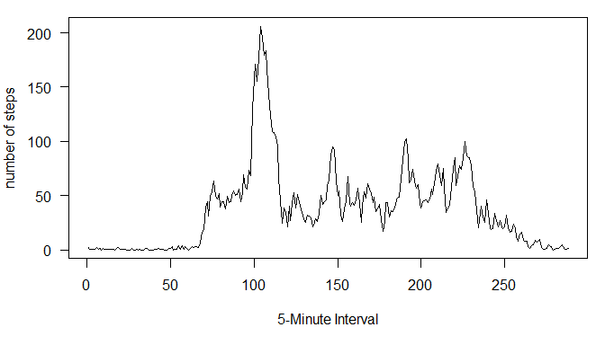
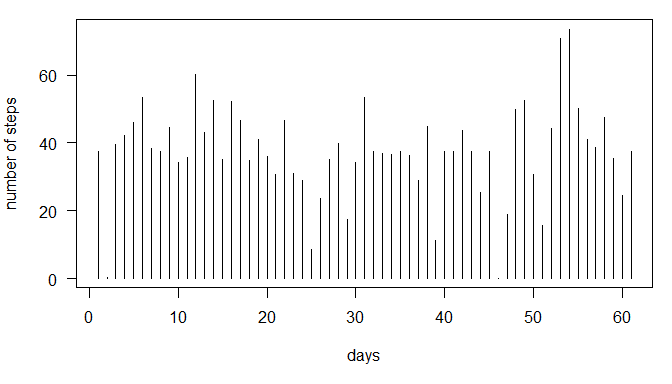
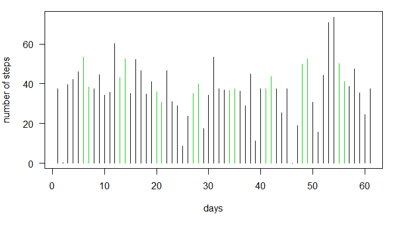

# Reproducible Research
By: Bidur Subedi
December 12, 2014

## Loading and preprocessing the data
The data that is available is in compressed *'.zip'* format. So, let us start with extracting the data file. Before that, I am going to change my working directory to the directory I just clonned from git.


```r
setwd("D:\\study\\Coursera\\Data Science Specialization\\Reproducible Research\\RepData_PeerAssessment1")
unzip("activity.zip")
```

Let us now load the data into a variable named movement and see the summary. 


```r
movement <- read.csv("activity.csv")
summary(movement)
```

```
##      steps                date          interval     
##  Min.   :  0.00   2012-10-01:  288   Min.   :   0.0  
##  1st Qu.:  0.00   2012-10-02:  288   1st Qu.: 588.8  
##  Median :  0.00   2012-10-03:  288   Median :1177.5  
##  Mean   : 37.38   2012-10-04:  288   Mean   :1177.5  
##  3rd Qu.: 12.00   2012-10-05:  288   3rd Qu.:1766.2  
##  Max.   :806.00   2012-10-06:  288   Max.   :2355.0  
##  NA's   :2304     (Other)   :15840
```
We found that out of 17568 data rows, 2304 have NA's value on the steps  column. So, let us remove all the rows with NA value and create another varaible *movement.clean*. We will use this variable for our initial analysis.

```r
movement.clean<-movement[!is.na(movement$steps),]
```

## What is mean total number of steps taken per day?

First of all, let us calculate the mean steps taken each day. We are splitting the steps with respect to date from movement.clean. Let us store means across days in a variable means and summarize it.


```r
means<-sapply(split(movement.clean$steps,movement.clean$date),mean)
summary(means)
```

```
##    Min. 1st Qu.  Median    Mean 3rd Qu.    Max.    NA's 
##  0.1424 30.7000 37.3800 37.3800 46.1600 73.5900       8
```

Here, we saw that the mean and median number of steps taken per day are 37.3825996 and 37.3784722. Let us now see the histogram for the data:


```r
par(mar=c(5,4,1,1),las=1)
plot(means,type="h",xlab="days",ylab="number of steps")
```

 

## What is the average daily activity pattern?

Similarly, let us calculate the means as across the intervals for all dates and save it to variable means, and see the summary of the means.


```r
means<-sapply(split(movement.clean$steps,movement.clean$interval),mean)
summary(means)
```

```
##    Min. 1st Qu.  Median    Mean 3rd Qu.    Max. 
##   0.000   2.486  34.110  37.380  52.830 206.200
```

```r
names(means[means=max(means)])
```

```
## [1] "1705"
```
The interval 1705 is the 5-minute interval, which has on average maximum number of steps taken. Let us now see the time series plot for average across intervals.

```r
par(mar=c(5,4,1,1),las=1)
plot(means,type="l",xlab="5-Minute Interval",ylab="number of steps")
```

 

## Imputing missing values

Here, let us consider the original data variable *movement*. Number of missing values in the dataset:

```r
sum(is.na(movement$steps))
```

```
## [1] 2304
```
This is significant number of missing values. So, I am imputting missing value with the mean for that 5-minute interval. I already have the mean for 5 minute intervals in the variable *means*. So, I will use its values to imput missing values.


```r
for(n in 1:nrow(movement)){
        if(is.na(movement[n,'steps'])){
                movement[n,'steps']<-means[toString(movement[n,'interval'])]
        }
}
```
Let us now see if there is any missing values in the data:

```r
sum(is.na(movement$steps))
```

```
## [1] 0
```
Let us now recalculate the average number of steps taken across each day:


```r
means<-sapply(split(movement$steps,movement$date),mean)
summary(means)
```

```
##    Min. 1st Qu.  Median    Mean 3rd Qu.    Max. 
##  0.1424 34.0900 37.3800 37.3800 44.4800 73.5900
```

Here, we saw that the mean and median number of steps taken per day are 37.3825996 and 37.3825996. There is nagligible difference between original means and median, and ones after imputing missing values. Let us now see the histogram for the data:


```r
par(mar=c(5,4,1,1),las=1)
plot(means,type="h",xlab="days",ylab="number of steps")
```

 

## Are there differences in activity patterns between weekdays and weekends?

I am considering Saturday and Sunday as weekends and remaining 5 days as week days. I will first categorize the data as weekdays and weekends and allocate color of 1 for weekdays and 3 for weekends.


```r
cols<-seq(1,1,length.out=61)
dates<-names(means)
for(n in 1:61){
        day<-weekdays(as.Date(dates[n],'%Y-%m-%d'))
        if(day == "Saturday" || day == "Sunday"){
                cols[n]<-3
        }
}
```
Let us now draw the histogram of the mean steps across each day:

```r
par(mar=c(5,4,1,1),las=1)
plot(means,type="h",col=cols,xlab="days",ylab="number of steps")
```

 
